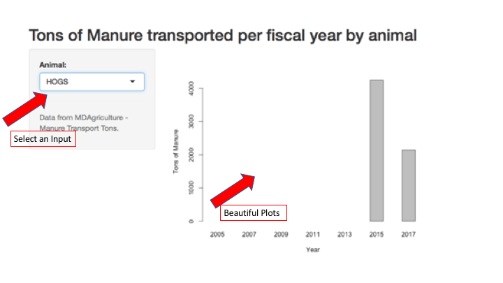

Manure App
========================================================
author: Jean-Paul Courneya
date: 13 February 2018
autosize: true

Background
========================================================

We are talking crap. No crap, this is real big business. 

- Solid waste management has major environmental implications
- Sustainability programs are being implemented which require guidance driven by data informed decisions
- Knowing real-time solid waste metrics based on use of routine reporting encourages best practice implementation and subsequent improvement and meeting of sustainability goals

Importance and Impact
========================================================

#### Maryland department of Agriculture data shows there has been an increase in transport of manure. This graph shows that since 2005 transport of Cattle manure in Maryland is increasing. 

Application
========================================================

## On demand reporting can inform where opportunities to intervene exist.

###### For example key decision makers and project analysts can see quickly when reporting practices have not been followed and trigger action. Like seen here where there is a gap in data collection. 

Conclusions
====================================
### What does the app look like?

***
### Things to consider

- Make an impact on sustainable practice with a data informed app.
- Improve working efficiency by seeing problem areas
